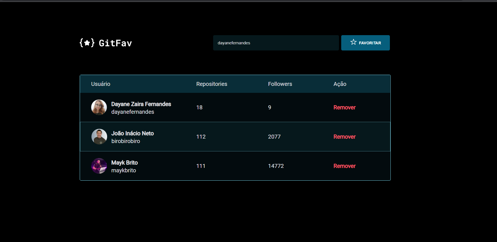
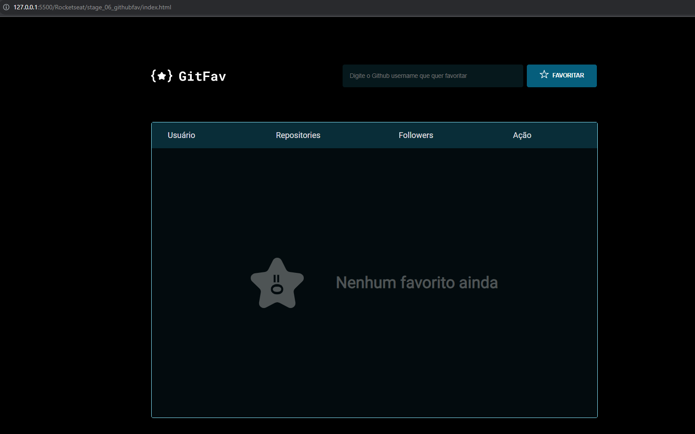

# Uso do JavaScript e CSS

### Essa tarefa faz parte do curso Explorer da [Rocketseat](https://www.rocketseat.com.br).

Nessa tarefa foi criada uma tabela para listagem de usuários favoritos do Github, fazendo uso de requisição assíncrona e consumindo dados da API do Github. 

## 🔖 Layout 

O figma do projeto está disponível nesse [Link](<https://www.figma.com/file/1Yza1EMI1xVJCWTKga97Eu/%5BDesafios-Explorer%5D-GitFav-(Copy)-(Copy)?node-id=0%3A1&mode=dev>).

## 👩‍💻 Demonstração

Que tal verificar como está sua sorte hoje? [Clique Aqui!](<https://www.linkedin.com/feed/update/urn:li:activity:7136382699438571520/?originTrackingId=Uh1zMHqETbGBJn8bxJMNMQ%3D%3D>)

